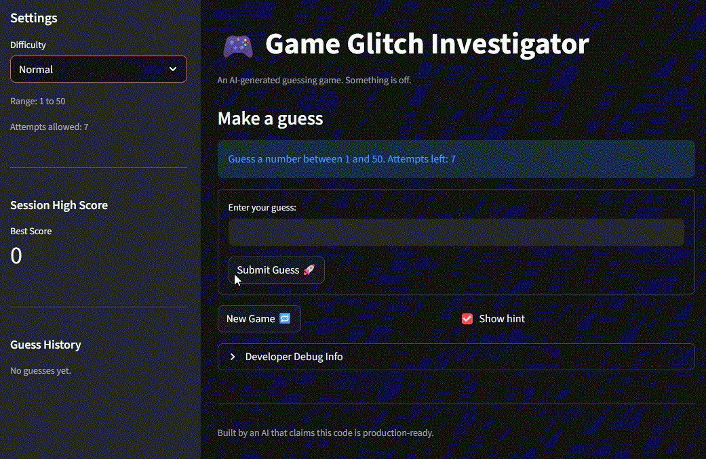
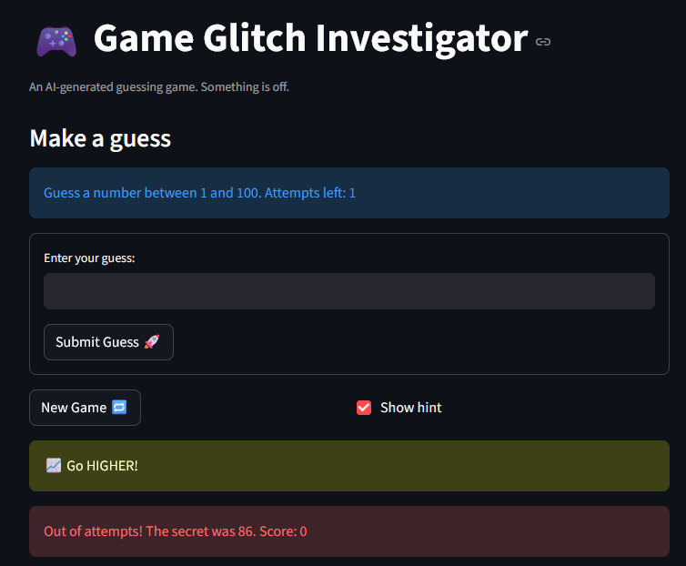
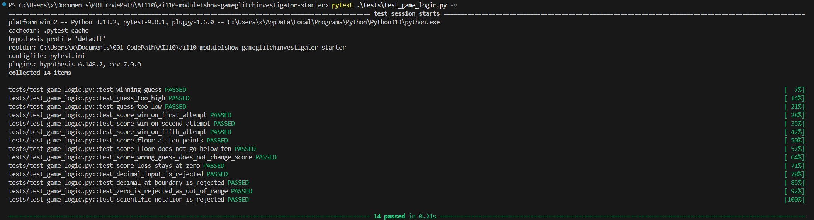
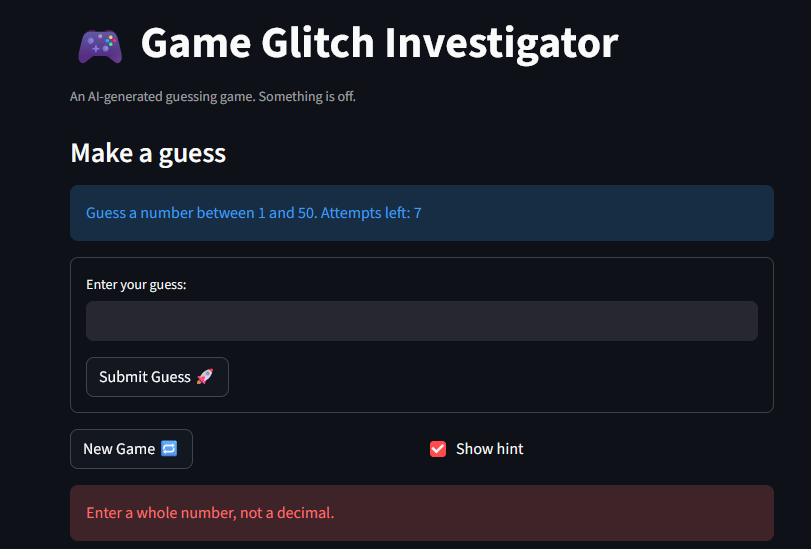
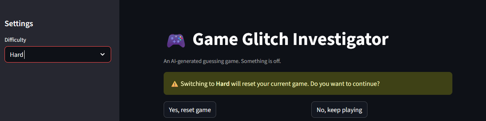
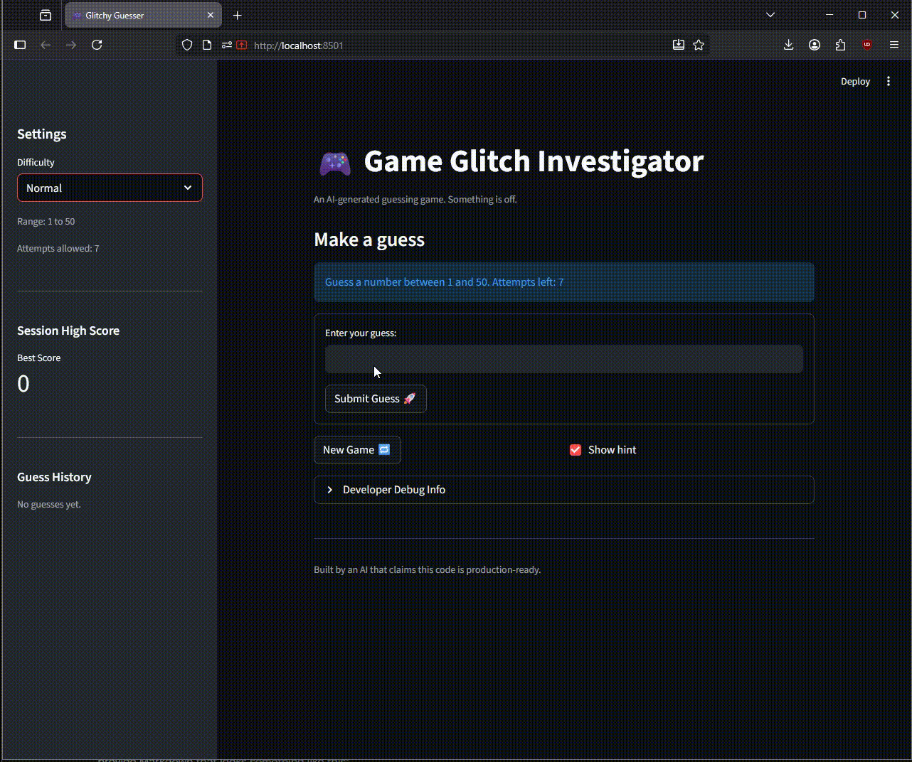

# 🎮 Game Glitch Investigator: The Fixed Guesser

## 🎯 About the Game

A number guessing game built with Streamlit. Pick a difficulty, then guess the secret number within the allowed attempts. After each guess you get a hint — higher or lower — and your final score depends on how quickly you find it. Fixed in conjunction with Claude.

## 🛠️ Setup

1. Install dependencies: `pip install -r requirements.txt`
2. Run the app: `python -m streamlit run app.py`
3. Run the tests: `pytest tests/test_game_logic.py -v`

## ✅ Bugs Fixed

| # | Bug | Fix |
|---|-----|-----|
| 1 | Hints were backwards ("Go Higher" when too high) | Swapped the hint messages in `check_guess` |
| 2 | New Game button did nothing | Reset all session_state fields and call `st.rerun()`; moved `st.stop()` guard below the reset handler |
| 3 | Negative / out-of-range numbers were accepted | Added `low` and `high` parameters to `parse_guess` with a range check |
| 4 | Score was confusing and could go negative | Simplified to win-only scoring: `max(10, 100 - 10*(attempt-1))` |
| 5 | Difficulty attempt limits were in the wrong order | Fixed map to `Easy: 10, Normal: 7, Hard: 5` |
| 6 | Submit button required multiple presses | Wrapped input in `st.form` so Enter and click both fire in one rerun |

## 📝 Document Your Experience

- [x] Describe the game's purpose.
- [x] Detail which bugs you found.
- [x] Explain what fixes you applied.

## 📸 Demo
### Winning guess!

### Better luck next time.

## 🚀 Stretch Features
### Challenge 1: Advanced Edge-Case Testing

### Example: Warning Message on Incorrect Input (Decimal)

### Example: Warning Message on Difficulty Change (Reset Game State)

### Challenge 2: Feature Expansion — Guess History Sidebar + Session High Score

- **Guess History** panel in the sidebar shows every guess and its outcome (most recent first) with directional icons.
- **Session High Score** metric tracks the best score across all games in the current browser session — it survives "New Game" resets.
- Agent Mode was used: Claude coordinated changes across four separate locations in `app.py` in one pass (new `high_score` state key, history dict format, post-win high-score update, and sidebar UI) without breaking the existing debug expander or reset logic.

### Challenge 3: Professional Documentation and Style
- All functions in `logic_utils.py` now have Google-style docstrings with `Args:`, `Returns:`, and `Examples:` sections, generated with Claude Code's AI documentation action.
- Return-type annotations added to all functions; `except Exception` narrowed to `except ValueError` for PEP 8 correctness.
- PEP 8 style review performed with Claude Code (AI Fix/Review action).

### Challenge 4: AI Model Comparison
- See **Section 6** in `reflection.md` for a comparison of Claude Code vs. ChatGPT (GPT-4o) on Bug 1 (the backwards hint logic), including a table analyzing Pythonicity, explanation clarity, and correctness.

