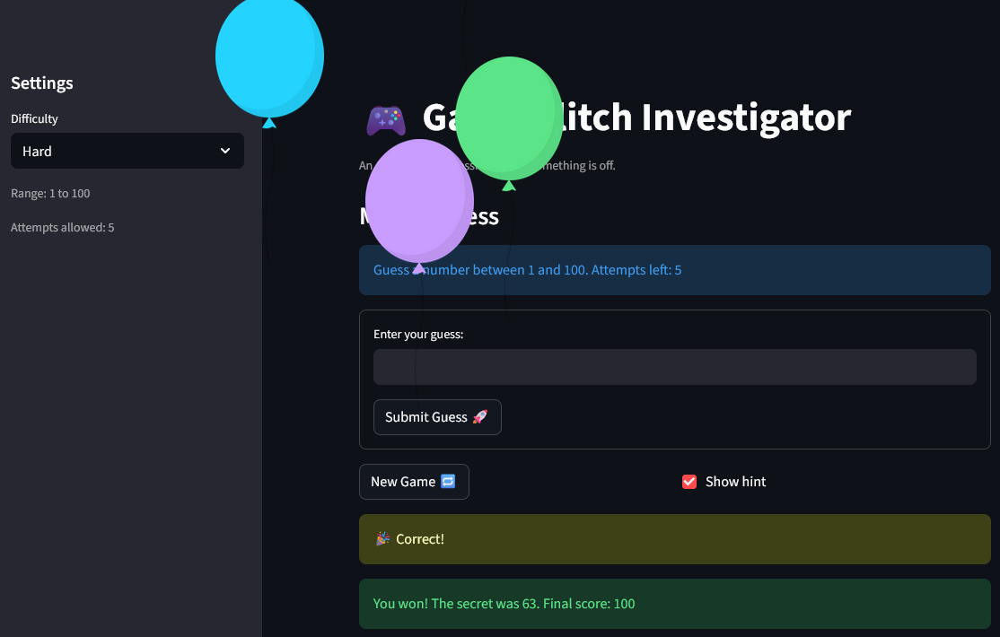

# 🎮 Game Glitch Investigator: The Fixed Guesser

## 🎯 About the Game

A number guessing game built with Streamlit. Pick a difficulty, then guess the secret number within the allowed attempts. After each guess you get a hint — higher or lower — and your final score depends on how quickly you find it.

## 🛠️ Setup

1. Install dependencies: `pip install -r requirements.txt`
2. Run the app: `python -m streamlit run app.py`
3. Run the tests: `pytest tests/test_game_logic.py -v`

## ✅ Bugs Fixed

| # | Bug | Fix |
|---|-----|-----|
| 1 | Hints were backwards ("Go Higher" when too high) | Swapped the hint messages in `check_guess` |
| 2 | New Game button did nothing | Reset all session_state fields and call `st.rerun()`; moved `st.stop()` guard below the reset handler |
| 3 | Negative / out-of-range numbers were accepted | Added `low` and `high` parameters to `parse_guess` with a range check |
| 4 | Score was confusing and could go negative | Simplified to win-only scoring: `max(10, 100 - 10*(attempt-1))` |
| 5 | Difficulty attempt limits were in the wrong order | Fixed map to `Easy: 10, Normal: 7, Hard: 5` |
| 6 | Submit button required multiple presses | Wrapped input in `st.form` so Enter and click both fire in one rerun |

## 📝 Document Your Experience

- [x] Describe the game's purpose.
- [x] Detail which bugs you found.
- [x] Explain what fixes you applied.

## 📸 Demo
### Winning guess!
- 
### Better luck next time.
- 

### Example: Warning Message on Difficulty Change (Reset Game State)
- 

## 🚀 Stretch Features
### Challenge 1: Advanced Edge-Case Testing
- 
### Example: Warning Message on Incorrect Input (Decimal)
- 

